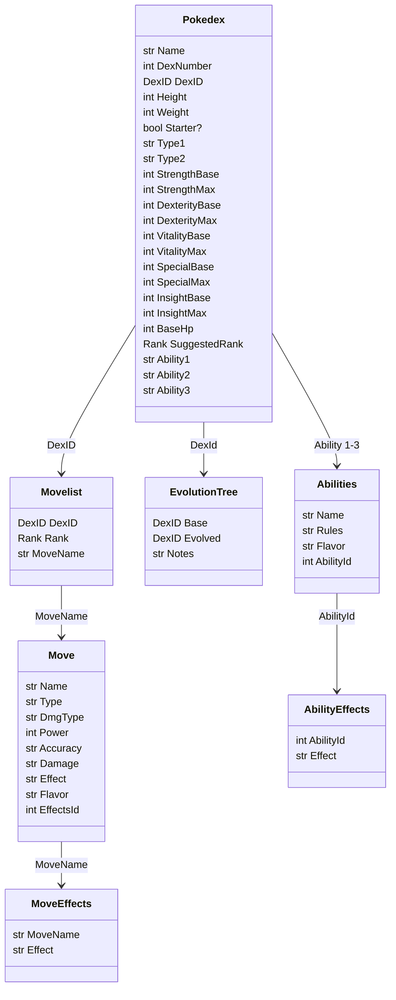

# Datatypes

Rank: Str, the ranks (can be a foreign key?)
DexID: Str, pokedex number plus identified for variant forms

In Obsidian, files are equivlent of rows. This works fine for Pokedex. Move lists I need to look into how to make that one file, then flatten the results into rows. IIRC, same keys get stacked into lists. Moves and Ability are also fine as is. Moves effects, abilities, and ability effects will need the same solution for move lists.

Tree (One item at each Key) - Pokedex, Move
Leaf (Multiple items for each Key) - Move list, Move Effects, Abilities, Ability Effects

Leaves need to be a single file for each key to be pulled via Key. Could be a massive file of objects as well, potentially. 

# SQL Diagram



# Dataview Templates

DexID must be a string, as must links in lists. 

DexID = four digit pokedex number, indicator of variant
Variants: **G**alar, **A**lolan, **H**isuian, **P**aldean, **M**ega, 

## Move lists

---
dexID: "0001"
moves: 
 - [Starter, "[[Tackle]]"]
 - [Starter, "[[Growl]]"]
---

```dataview
TABLE WITHOUT ID
    T[0] AS Learned,
    T[1] AS Move
FROM "Pokerole SRD/Movelists"
flatten moves as T
where file.name = this.file.name
```